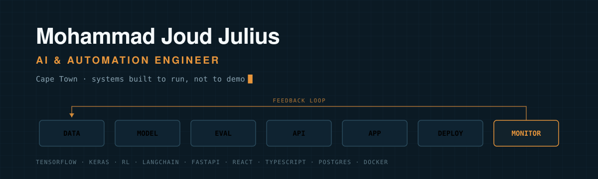

**The model is the easy part. I build everything around it.**

---

## Hey, I'm Joud

I build AI and automation systems that are meant to run, not just demo. The model is usually the easy part — the work is everything around it: the data feeding it, the API serving it, the app someone actually uses, and the deployment and monitoring that keep it alive after launch.

I'm based in Cape Town, I like problems with a lot of moving parts, and I'm always happy to talk shop — whether that's agents, reward functions, or why your pipeline keeps falling over on Fridays.

---

## Featured Projects

### Expense App
**Local-first budgeting that knows your real take-home pay**

A local-first Android and web app that tracks income, debit orders, recurring expenses, pay cycles, expiry history, reminders, and portable backups. Built because every budgeting app I tried wanted my bank login and still got the pay cycle wrong.

- **Local-first** — your financial data stays on your device, not on someone's server
- **Pay-cycle aware** — models real cycles instead of calendar months
- **Debit-order tracking** — recurring expenses and expiry history in one view
- **Reminders** — before the money leaves, not after
- **Portable backups** — export and restore without an account

**Tech stack:** Android + web, local persistence, portable backup format

**[View >>](https://github.com/judejulius/expense_app)**

## The Pipeline

Each stage in the banner is a real part of how I work, not a slide.

| Stage | What happens here |
|---|---|
| **Data** | Automated data pipelines, event-driven workflows, and the plumbing that gets clean input to a model in the first place |
| **Model** | Deep learning with TensorFlow and Keras, reinforcement learning agents, LLM-powered and tool-using applications |
| **Eval** | Checking a model actually does what it's meant to before it's trusted with anything real |
| **API** | FastAPI and Node backends, REST APIs, inference endpoints |
| **App** | React and TypeScript front ends people can actually use |
| **Deploy** | Dockerized, reproducible services rather than one-off scripts |
| **Monitor** | Keeping systems observable and controllable after they ship, not just on the day they ship |

---

## Philosophy

**Follow the problem.** Technology should fit the problem, not the other way around — I don't reach for an LLM because it's available, I reach for it when it's the right tool.

**Value over novelty.** An AI feature is only worth building if it removes real complexity, automates real work, or does something that wasn't practical before.

**Understandable beats impressive.** A system should be as complex as the problem requires and no more. If I can't explain why a piece exists, it probably shouldn't.

**Finished means running.** Shipped, observable, and still working next month — not a notebook that produced one good number once.

---

## Technical Stack

| Layer | Tools |
|---|---|
| **AI / ML** | TensorFlow, Keras, reinforcement learning, LangChain, LLM integrations |
| **Backend** | Python, FastAPI, Node.js, PostgreSQL, MongoDB |
| **Frontend** | React, TypeScript, JavaScript, Reflex |
| **Infra** | Docker, Git, Linux |

---

## The Numbers

---

## Let's Connect

I'm always interested in collaborating on AI systems, automation, or anything with enough moving parts to be interesting. Quietly open to the right opportunity.

[**Portfolio**](https://www.joudjulius.co.za/) · [**LinkedIn**](https://www.linkedin.com/in/mohammad-joud-julius-a56299212/) · [**GitHub**](https://github.com/judejulius)

 

